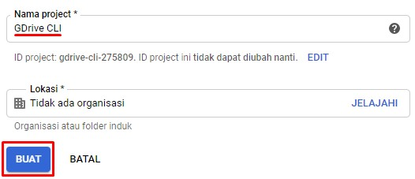

# GDrive CLI Builder
[GDrive CLI](https://github.com/gdrive-org/gdrive) is a great tools, but because the owner is hardcoded the credentials directly to the [code](https://github.com/prasmussen/gdrive/blob/c3cbcceedd6beb1fcff30f06ea7be7c29558d181/handlers_drive.go#L17), it's makes every one who use the [release package](https://github.com/gdrive-org/gdrive/releases) from this project is sharing the same quota. So i try to make this repository to help who want to build the package using their own credentials.

Note: This Repo is using a Fork of GDrive in this [Repo](https://github.com/Msameim181/gdrive)

<details>
<summary>
    Problems that arise due to limit quota or etc.
</summary>


```html
Sign in with Google temporarily disabled for this app
This app has not been verified yet by Google in order to use Google Sign In.
```

</details>

## Prerequisites
- GitHub Account
- Google Account

## How to
<details>
<summary>
    Create your own Google Drive API credentials
</summary>

1. Go to Google developer [console](https://console.developers.google.com/apis/dashboard) and create new project
    >> P.S. This page only shown if it's your first time accesing Google developer console

    - Read terms and conditions ✌ and then click `ACCEPT AND CONTINUE`

    

    - Create a project if you have not yet by click the `CREATE PROJECT` button

    

    - Fill out your project name and then click `CREATE`

    

2. Go to Google Drive API [section](https://console.developers.google.com/apis/library/drive.googleapis.com) and enable it
    - Click `ACTIVATE`

    

3. Create Credential [1]
    - Click `CREATE CREDENTIAL`

    

    - Fill out the form and then click `What credentials do I need?`

    

4. Create OAuth consent screen
    - Click `SET UP CONSENT SCREEN`

    

    - Choose External and then click `CREATE`

    

    - Fill out the form and then click `SAVE`

    

5. Create Credential [2]
    - Fill out your client id name and then click `CREATE OAUTH CLIENT ID`

    

    - Download your `client_id.json` file and keep this file

    

</details>

<details>
<summary>
    Setup GitHub Actions
</summary>

1. Fork this repository
    - Click the `fork` button

    

2. Enable GitHub Actions in your repository
    - Click the `Actions` tab and then click `I understand my workflows, go ahead and run them`

    

3. Create secret that contain your CLIENT_ID and CLIENT_SECRET
    - Click `Settings` > `Secrets` > `Actions` > `New repository secret`

    

    - Open your `client_id.json` file then copy `CLIENT_ID`, `CLIENT_SECRET` and `REDIRECT_URL` to create secrets

    -- Set `REDIRECT_URL` like the image below. You can change the `REDIRECT_URL` to your own, but you must change the `REDIRECT_URL` in `Google Credential page` too.

    
    
    - Make sure you have CLIENT_ID, CLIENT_SECRET and REDIRECT_URL secret

    
</details>

<details>
<summary>
    Build GDrive CLI using GitHub Actions
</summary>

1. Choose your platform by editing the [`list.txt`](./build/list.txt) file inside build directory

    
    <!--  -->

    - Edit file by click the pencil icon

    

    - Write your platform in `list.txt` file. You can write multiple platform (split by line)

        <details>
        <summary>
            <b>Supported platfrom</b>
        </summary>

        - darwin/386
        - darwin/amd64
        - darwin/arm
        - darwin/arm64
        - dragonfly/amd64
        - freebsd/386
        - freebsd/amd64
        - freebsd/arm
        - linux/386
        - linux/amd64
        - linux/arm
        - linux/arm64
        - linux/ppc64
        - linux/ppc64le
        - linux/mips64
        - linux/mips64le
        - linux/rpi
        - netbsd/386
        - netbsd/amd64
        - netbsd/arm
        - openbsd/386
        - openbsd/amd64
        - openbsd/arm
        - plan9/386
        - plan9/amd64
        - solaris/amd64
        - windows/386
        - windows/amd64
        </details>

    

    - Save this file by commit the change

    >> P.S. Because GitHub Actions didn't have manual trigger to build, so we only can trigger the build process by commit changes and push it to `master` branch

    

    - Inspect your build process by click `Actions` > `Build GDrive CLI` workflow > `{Your commit message}` *i.e.* **Update list.txt**

    

    - Make sure all step is successfully build

    
    

    - If the build process has been finished, you can download the file by click `Artifacts` button in top-right section

    >> P.S. You can also delete this file by click the trash icon so another user cannot download this file

    
</details>

<details>
<summary>
    Using GDrive CLI
</summary>

On unix systems run `chmod +x {filename}` after download to make the binary executable.

[Official documentation](https://github.com/gdrive-org/gdrive#usage)
</details>

### Contributors
- Ma'ruf Shidiq - *Initialize GitHub Actions workflow* - [marufshidiq](https://github.com/marufshidiq)
- Văn Lộc Võ - *Add support to compile for mips/mipsle architecture* - [vvanloc](https://github.com/vvanloc)

### Thanks to
[prasmussen](https://github.com/prasmussen) and [all](https://github.com/gdrive-org/gdrive/graphs/contributors) GDrive CLI contributor for creating a great tools
